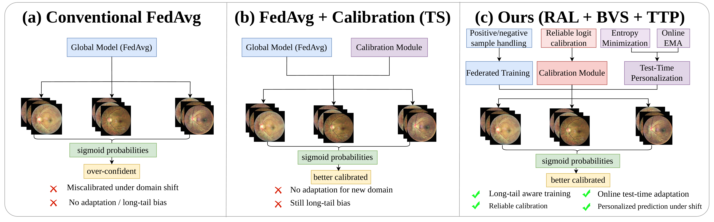

# 🩺 Fed-FTTP: Federated Fundus Test-Time Personalization

## 📝 Project Overview

This project implements **Fed-FTTP**, a federated learning framework for cross-site multi-label ocular disease recognition. It addresses three core challenges in medical federated learning: class imbalance via **Robust Asymmetric Loss (RAL)**, label shift via **Bias-Corrected Vector Scaling (BVS)**, and domain shift via **Test-Time Personalization (TTP)**. Built on PyTorch, it supports multiple FL algorithms, TTA methods, calibration techniques, and cross-dataset evaluation.

### Framework




### Main Results on OIA-ODIR (Hybrid Shift, Off-site)

| Method | Kappa | F1 | AUC | Final |
|--------|-------|-----|-----|-------|
| FedAvg (BCE) | 0.0410±0.0154 | 0.1131±0.0160 | 0.6787±0.0164 | 0.2776±0.0100 |
| FedProx | 0.0402±0.0177 | 0.1119±0.0186 | 0.6784±0.0175 | 0.2768±0.0130 |
| FedBN | 0.0124±0.0071 | 0.1271±0.0007 | 0.6084±0.0119 | 0.2493±0.0060 |
| SCAFFOLD | 0.0783±0.0337 | 0.1497±0.0262 | 0.7020±0.0038 | 0.3100±0.0190 |
| Per-FedAvg | 0.0395±0.0129 | 0.1123±0.0152 | 0.6783±0.0174 | 0.2767±0.0100 |
| FedMLP | 0.2166±0.0389 | 0.1016±0.0175 | 0.6424±0.0391 | 0.3202±0.0310 |
| TENT | 0.0304±0.0106 | 0.1114±0.0087 | 0.5636±0.0058 | 0.2351±0.0050 |
| T3A | 0.0000±0.0000 | 0.2048±0.0000 | 0.5201±0.0139 | 0.2416±0.0050 |
| SHOT | 0.0358±0.0050 | 0.0932±0.0131 | 0.5348±0.0185 | 0.2213±0.0100 |
| MEMO | 0.0305±0.0156 | 0.1039±0.0213 | 0.4800±0.0258 | 0.2048±0.0210 |
| ML-GCN | 0.0989±0.0167 | 0.1700±0.0100 | 0.6866±0.0139 | 0.3185±0.0040 |
| DICNet | 0.3398±0.0162 | 0.3541±0.0188 | 0.7515±0.0076 | 0.4818±0.0120 |
| RANK | 0.3331±0.0219 | 0.3494±0.0041 | **0.7573±0.0097** | 0.4799±0.0050 |
| **Fed-FTTP (Batch)** | **0.4233±0.0138** | **0.4944±0.0128** | 0.7030±0.0314 | **0.5402±0.0070** |
| **Fed-FTTP (Online)** | 0.3634±0.0134 | 0.4419±0.0099 | 0.6710±0.0431 | 0.4921±0.0220 |

## 🚀 Key Features

- **Federated Learning Algorithms**: FedAvg, FedProx, FedBN, SCAFFOLD, PerFedAvg
- **Test-Time Adaptation (TTA)**: TENT, T3A, SHOT, MEMO, BatchNorm, ATP
- **Label Shift Estimation**: EM (Expectation-Maximization), BBSE (Black-Box Shift Estimation)
- **Calibration Methods**: BVS (Bias-Corrected Vector Scaling), BCTS, VS, TS
- **Loss Functions**: RAL (Robust Asymmetric Loss) with polynomial focusing and Hill-based truncation
- **Model Zoo**: ResNet18/50 (single & multi-label), ML-GCN (GCN-augmented), CNN
- **Multi-Label Metrics**: Cohen's Kappa, F1, AUC, bACC, Final (Kappa + F1 + AUC)
- **Cross-Dataset Evaluation**: OIA-ODIR → REFUGE, DDR, Bajwa, PAPILA, HRF

## 📁 Directory Structure

```
Fed-FTTP/
├── src/                          # Core source code
│   ├── algorithm/                #   FL + TTA algorithms (FedAvg, ATP, TENT, ...)
│   ├── model/                    #   Models, losses, metrics
│   ├── dataset/                  #   ODIR data loading & preparation
│   ├── partition/                #   Label-skew data partitioning
│   ├── utils/                    #   History, I/O utilities
│   ├── scripts/                  #   Standalone tools (eval, ML-GCN setup)
│   ├── baselines/                #   Baseline methods (DICNet, FedMLP, RANK)
│   ├── main.py                   #   Main entry point
│   ├── options.py                #   CLI argument parser
│   └── config.yaml.template      #   Configuration template
├── experiments/                  # Experiment scripts
│   ├── _common.sh                #   Shared config & helpers
│   └── odir/hybrid/              #   Hybrid shift pipeline
├── fig/                          # Figures
├── requirements.txt
├── setup.py
├── DATA.md
├── LICENSE
└── CITATION.cff
```

## 🛠️ Environment Requirements

- Python 3.8+
- PyTorch ≥ 1.9.0
- torchvision ≥ 0.10.0
- numpy ≥ 1.19.0
- scipy ≥ 1.6.0
- scikit-learn ≥ 0.24.0
- pandas ≥ 1.2.0
- pillow ≥ 8.0.0
- tqdm ≥ 4.50.0
- matplotlib ≥ 3.3.0
- pyyaml ≥ 5.4.0
- CUDA (optional, recommended for training)

```bash
pip install -r requirements.txt
```

## 📦 Data Preparation

1. Download the [OIA-ODIR dataset](https://odir2019.grand-challenge.org/dataset/)
2. Organize images as follows:

```
data/
├── OIA-ODIR_dataset_multi/
│   └── RGB_preprocessed/
│       ├── Training Set/
│       ├── On-site Test Set/
│       └── Off-site Test Set/
└── oia_odir/
    ├── train_labels.txt
    └── mlgcn_adj_odir_multi.npy
```

3. Copy and edit the configuration:

```bash
cp src/config.yaml.template src/config.yaml
# Edit src/config.yaml with your data paths
```

See [DATA.md](DATA.md) for detailed instructions.

## ⚡ Quick Start

### 1. Prepare Data Partitions

```bash
bash experiments/odir/hybrid/data_prepare.sh
```

### 2. Pretrain a Model

```bash
bash experiments/odir/hybrid/pretrain_fedavg_resnet18.sh
```

### 3. Run TTP Training (Test-Time Personalization)

```bash
bash experiments/odir/hybrid/atp_train_resnet18.sh
```

### 4. Evaluate

```bash
bash experiments/odir/hybrid/atp_test_resnet18.sh
```

### 5. Cross-Dataset Evaluation (optional)

```bash
python src/scripts/eval_external.py        # Direct evaluation
python src/scripts/eval_external_ttp.py    # With TTP adaptation
```

## 🙏 Acknowledgements

- [PyTorch](https://pytorch.org/)
- [FedLab](https://fedlab.readthedocs.io/)
- [ML-GCN](https://github.com/Megvii-Nanjing/ML-GCN)
- [OIA-ODIR](https://odir2019.grand-challenge.org/)
- [TENT](https://github.com/DequanWang/tent)
- [SHOT](https://github.com/tim-learn/SHOT)

## 📄 License

MIT License — see [LICENSE](LICENSE) for details.
